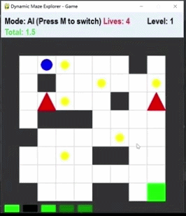

# Dynamic Maze Explorer: A Maze Navigation Game Based on Deep Q-Learning
  
**Author**: ZHANG Chuyue  
**YouTube**: https://youtu.be/0_h6cyYHTCM
**GitHub**: https://github.com/chuyuezhang2-cmd/Assignment1-ZHANG-Chuyue


## AI Mode Demo (Dynamic Gameplay)

<div align="center">
  
  <p><em>AI agent navigating the maze in real-time (looping)</em></p>
</div>

## Project Overview

Dynamic Maze Explorer is a maze navigation game where an agent learns to reach the green goal while collecting yellow coins and avoiding moving red traps using Deep Q-Network (DQN), an advanced form of Q-Learning.

- **Objective**: Navigate the 10x10 maze to the goal, maximizing rewards.
- **Modes**: AI (autonomous DQN agent) and Manual (player control via arrow keys + Space to stay).
- **Controls**: Press 'M' to switch modes, 'P' to pause, 'R' to reset.
- **Lives**: Start with 6, lose one on trap collision or timeout.

## Technology Stack

- Python 3.9.7
- PyTorch (DQN model and training)
- Pygame (game rendering and interaction)
- NumPy (grid and state handling)

## How to Run

Follow these steps to get the game running on your machine.

### 1. Clone the Repository (if running from GitHub)

```bash
git clone https://github.com/chuyuezhang2-cmd/Assignment1-ZHANG-Chuyue.git
cd Assignment1-ZHANG-Chuyue
# Create virtual environment
python -m venv venv

# Activate on Windows
venv\Scripts\activate

# Activate on macOS/Linux
source venv/bin/activate

pip install pygame torch numpy

python main.py

Welcome to Dynamic Maze Explorer!
1: Training model (run train.py)
2: Playing game (run play.py)
3: Exit
Your choice:

python main.py
# Choose 1: Training model


